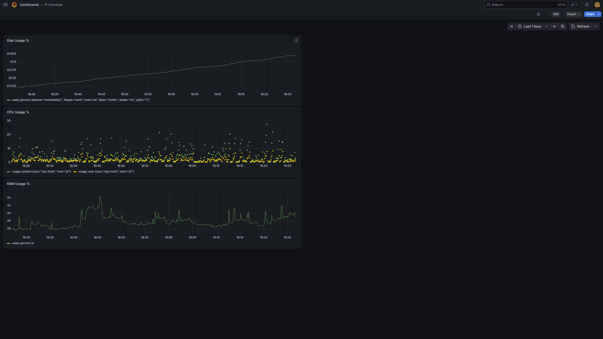
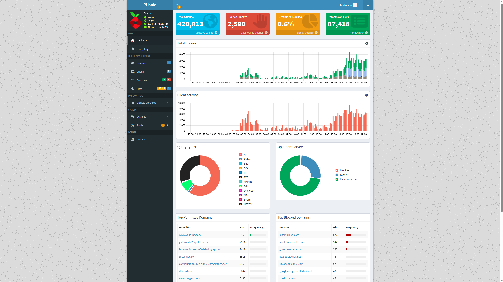
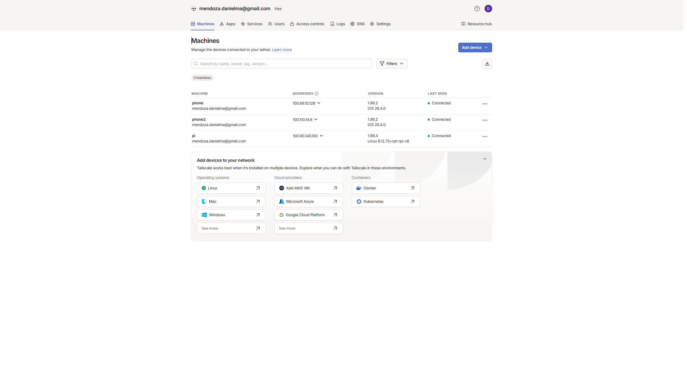

# Pi Homelab: Private DNS + VPN + Monitoring

A self-hosted network infrastructure stack running on a Raspberry Pi 4B.  
Built to demonstrate hands-on networking, DNS architecture, VPN configuration, and Linux systems administration.

---

## Summary

| Component | Purpose | Status |
|-----------|---------|--------|
| **Pi-hole** | Network-wide DNS filtering | ✅ Running |
| **Unbound** | Recursive DNS resolver (no third-party forwarding) | ✅ Running |
| **WireGuard** | VPN server (configured, ISP-blocked inbound — see notes) | ✅ Configured |
| **Tailscale** | WireGuard-based VPN overlay — bypasses ISP restrictions | ✅ Running |
| **InfluxDB v2** | Time-series metrics database | ✅ Running |
| **Telegraf** | System metrics collection agent | ✅ Running |
| **Grafana** | Live monitoring dashboard | ✅ Running |
| **Nmap** | Network device inventory (manual) | ✅ Installed |

**All DNS traffic on the home network routes through Pi-hole → Unbound → root DNS servers.**  
**No queries forwarded to Google, Cloudflare, or the ISP.**

---

## Screenshots

### Grafana — Live System Monitoring

*Real-time CPU, RAM, and disk usage tracked via Telegraf → InfluxDB → Grafana*

### Pi-hole — DNS Filtering Dashboard

*420k+ queries processed, 87,418 domains on blocklist. Upstream server shows `localhost#5335` (Unbound) confirming no third-party DNS forwarding*

### Tailscale — VPN Connected Devices

*Pi and mobile devices connected via Tailscale overlay network — routes DNS through Pi-hole on cellular*

---

## Hardware

- **Device:** Raspberry Pi 4B — 2GB RAM
- **Case:** Geekworm passive heatsink (no fan, no throttling observed under load)
- **Storage:** MicroSD
- **Network:** Ethernet (no WiFi)
- **Router:** Netgear RAX120v2
- **Modem:** Motorola MB8600 (cable, Cox ISP)

---

## Architecture

```
[All Network Devices]
        |
        | DNS queries (port 53)
        ▼
[Pi-hole — 192.168.1.15]
  Blocklist: StevenBlack Unified Hosts (87,418 domains)
  Blocks: ads, trackers, malware domains
        |
        | Allowed queries forwarded to local resolver
        ▼
[Unbound — 127.0.0.1:5335]
  Recursive resolver
  Queries root DNS servers directly
  No third-party DNS provider (no Cloudflare, no Google)
        |
        | Direct root server lookups
        ▼
[Root DNS Servers]


[Remote Device on Cellular]
        |
        | Tailscale VPN tunnel (WireGuard protocol)
        ▼
[Pi — Tailscale IP: 100.90.149.100]
  Routes DNS through Pi-hole
  Provides ad-blocking + private DNS anywhere
```

---

## DNS Architecture — Key Concepts Demonstrated

### Why run your own recursive resolver?

Standard setups forward DNS queries to a third party (Google 8.8.8.8, Cloudflare 1.1.1.1).  
Every query you make is logged by that provider — they can see every domain you visit.

**Unbound eliminates this:**  
Instead of forwarding to a resolver, Unbound queries the root DNS servers directly, walks the delegation chain, and resolves the answer itself. Zero third-party visibility.

### Query flow with Unbound

```
Browser requests: reddit.com
  → Pi-hole checks blocklist → not blocked → forward to Unbound
    → Unbound queries root servers: "Who handles .com?"
    → Root returns: "Ask Verisign (a.gtld-servers.net)"
    → Unbound asks Verisign: "Who handles reddit.com?"
    → Verisign returns: "Ask Reddit's NS servers"
    → Unbound asks Reddit's NS: "What is reddit.com?"
    → Returns IP address
  → Pi-hole caches and returns IP to browser
```

### Pi-hole blocking mechanism

```
Browser requests: doubleclick.net
  → Pi-hole checks gravity database → MATCH found
  → Returns 0.0.0.0 (null address)
  → Browser gets no IP → ad never loads
  → No connection made to ad server
```

Verified with:
```bash
dig doubleclick.net @127.0.0.1
# Returns: doubleclick.net. 2 IN A 0.0.0.0
```

---

## VPN Configuration

### WireGuard (server-side configured)

WireGuard is installed and the server is running on the Pi. The client config was generated and tested successfully on LAN.

**Why remote access didn't work — ISP restriction (documented for learning):**

Testing showed port 51820/UDP was closed externally. After ruling out:
- Router port forwarding misconfiguration (rule was correctly set)
- CGNAT (confirmed not behind CGNAT — router has real public IP)
- SIP ALG interference (disabled on router)
- IP mismatch (confirmed public IP was correct in client config)

Port 443/UDP was also closed, pointing to ISP-level inbound UDP blocking on the residential Cox plan.

**Resolution: Tailscale overlay network**

Tailscale uses the WireGuard protocol but establishes outbound connections, eliminating the need for open inbound ports. This is the correct architectural solution for ISPs that block inbound UDP on residential lines.

### Tailscale

- Pi enrolled as exit node candidate
- iPhone 13 Pro Max enrolled
- All DNS traffic routes through Pi-hole when Tailscale is active on cellular
- Access to Pi-hole dashboard, Grafana, and local services from anywhere

---

## Key Configuration Files

### Pi-hole custom upstream DNS
```
# /etc/pihole/custom.list
127.0.0.1#5335   ← Points to local Unbound instance
```

### Unbound config (`/etc/unbound/unbound.conf.d/pi-hole.conf`)
```
server:
    verbosity: 0
    interface: 127.0.0.1
    port: 5335
    do-ip4: yes
    do-udp: yes
    do-tcp: yes
    do-ip6: no
    harden-glue: yes
    harden-dnssec-stripped: yes
    edns-buffer-size: 1232
    prefetch: yes
    num-threads: 1
    private-address: 192.168.0.0/16
    private-address: 172.16.0.0/12
    private-address: 10.0.0.0/8
```

### WireGuard server config (`/etc/wireguard/wg0.conf`)
```
[Interface]
PrivateKey = <server_private_key>
Address = 10.0.0.1/24
ListenPort = 51820
PostUp = iptables -A FORWARD -i wg0 -j ACCEPT; iptables -t nat -A POSTROUTING -o eth0 -j MASQUERADE
PostDown = iptables -D FORWARD -i wg0 -j ACCEPT; iptables -t nat -D POSTROUTING -o eth0 -j MASQUERADE

[Peer]
PublicKey = <client_public_key>
AllowedIPs = 10.0.0.2/32
```

---

## Monitoring Stack

**Data flow:** Telegraf (collect) → InfluxDB (store) → Grafana (visualize)

### Telegraf collects every 10 seconds:
- CPU usage (user, system, idle split)
- RAM usage (used %)
- Disk usage (root partition %)
- Swap, kernel stats, network I/O

### Grafana Dashboard: Pi Homelab

Three live panels on a single dashboard:
- **RAM Usage %** — baseline ~30-35% at idle
- **CPU Usage %** — user + system separated, baseline ~5-15%
- **Disk Usage %** — ~20% used on SD card

InfluxDB query used for CPU panel (Flux):
```flux
from(bucket: "pi_metrics")
  |> range(start: -1h)
  |> filter(fn: (r) => r._measurement == "cpu")
  |> filter(fn: (r) => r._field == "usage_user" or r._field == "usage_system")
  |> filter(fn: (r) => r.cpu == "cpu-total")
  |> aggregateWindow(every: v.windowPeriod, fn: mean)
```

---

## Performance at Steady State

| Metric | Idle | Normal Use |
|--------|------|------------|
| CPU | 5–15% | 20–40% |
| RAM | ~700MB / 2GB (35%) | ~900MB (45%) |
| Disk | ~20% | ~20% |
| Temp | No throttling observed | No throttling observed |

The passive heatsink case handles the thermal load without any active cooling.

---

## Troubleshooting Log

A selection of real issues encountered and resolved during build:

| Problem | Root Cause | Fix |
|---------|-----------|-----|
| Pi wouldn't boot | SD card adapter lock switch was in locked/read-only position | Flipped physical lock switch, reflashed with Raspberry Pi Imager |
| Pi-hole `pihole status` permission error | Known bug in Pi-hole v6.4 — `/etc/pihole/versions` permissions | `sudo chmod 644 /etc/pihole/versions` |
| Pi-hole blocking not working after install | FTL service needed restart to load gravity DB | `sudo systemctl restart pihole-FTL` |
| WireGuard service failed on start | `resolvconf` package not installed | `sudo apt install resolvconf -y` |
| WireGuard key mismatch (no handshake) | Multiple key regenerations caused server/client configs to go out of sync | Regenerated both keypairs, methodically updated each config, verified with `sudo wg show` |
| WireGuard remote access failing | ISP blocking inbound UDP on residential line | Switched to Tailscale overlay network |
| Pi can't resolve DNS for itself | `resolv.conf` pointing to `127.0.0.1` (Pi-hole), Pi-hole not handling Pi's own lookups | Added `nameserver 8.8.8.8` to `/etc/resolv.conf` for package installs |
| InfluxDB service crashing on start | Service file running as wrong user | Removed `User=` line from systemd service file |
| Telegraf not sending data | API token missing quotes in TOML config | Wrapped token value in quotes: `token = "value"` |
| Grafana showing no data | Wrong InfluxDB datasource selected (v1 vs v2) | Switched panel datasource to the correctly configured v2 instance |
| Grafana CPU panel confusing | Showing `usage_idle` — inverse of what you'd expect | Changed query to `usage_user + usage_system` for intuitive display |

---

## Network Scan (Nmap)

```bash
sudo nmap -sn 192.168.1.0/24
```

Sample output from initial scan — 10 devices found:

```
192.168.1.1   — Netgear router
192.168.1.8   — Nintendo (Switch)
192.168.1.10  — Microsoft (Windows PC / Xbox)
192.168.1.15  — Raspberry Pi (this device)
+ 6 additional devices (phones, IoT)
```

---

## Services Running on Boot

```bash
sudo systemctl is-enabled pihole-FTL     # enabled
sudo systemctl is-enabled unbound        # enabled
sudo systemctl is-enabled wg-quick@wg0   # enabled
sudo systemctl is-enabled influxdb       # enabled
sudo systemctl is-enabled telegraf       # enabled
sudo systemctl is-enabled grafana-server # enabled
```

All services configured to auto-start on reboot.

---

## Skills Demonstrated

- **Linux administration** — Raspberry Pi OS (Debian Trixie, 64-bit), systemd service management, file permissions, package management
- **DNS architecture** — Recursive resolution, DNS filtering, blocklist management, DNSSEC hardening
- **VPN configuration** — WireGuard key management, iptables NAT/masquerade rules, split tunneling concepts
- **Network troubleshooting** — CGNAT identification, ISP restriction diagnosis, port forwarding, SIP ALG
- **Monitoring stack** — Time-series data collection, InfluxDB v2 Flux queries, Grafana dashboard design
- **Security fundamentals** — Private key hygiene, least-privilege service accounts, local-only admin interfaces

---

## Future Additions (Beelink N100 Mini PC)

- **Fail2Ban** — Automated intrusion prevention
- **Suricata** — Network IDS/IPS
- **ClamAV** — Antivirus scanning
- **Frigate** — Local NVR for security cameras (no cloud)
- **Home Assistant** — Home automation hub
